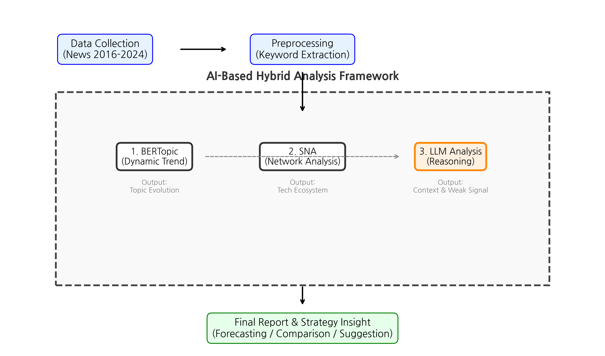
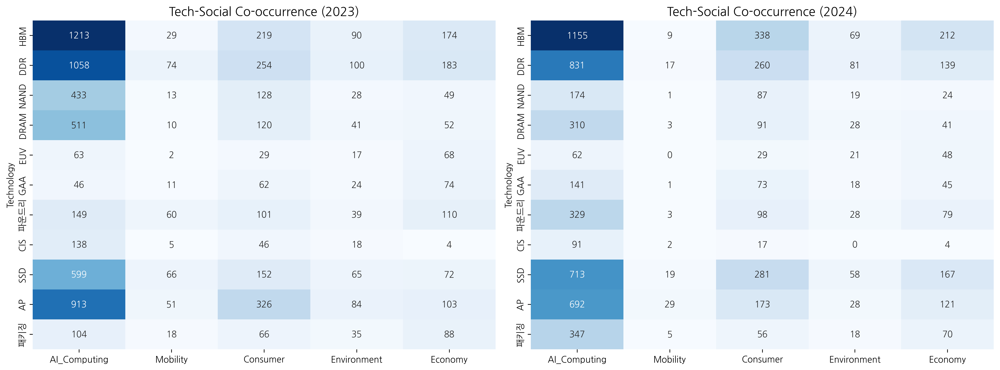
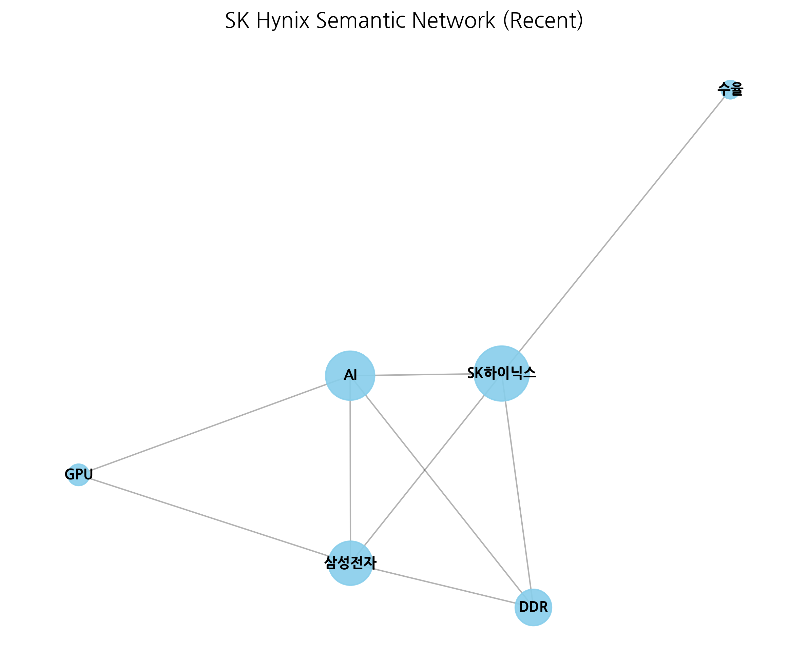
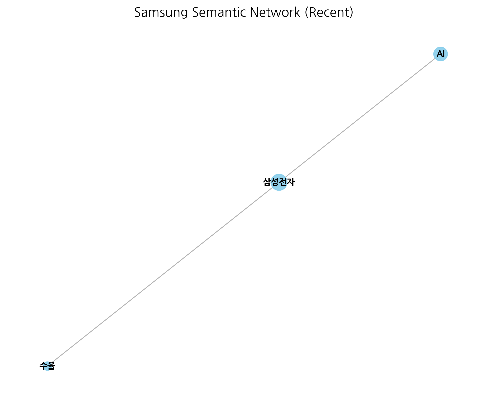
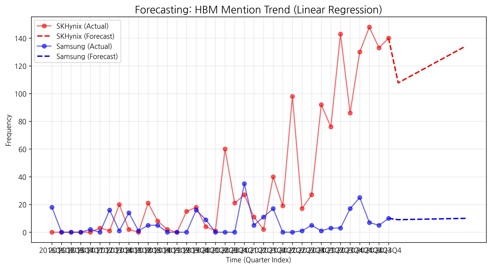

# 연구 보고서: 반도체 기술 혁신과 사회적 영향의 동태적 분석
## - AI 기반 하이브리드 텍스트 분석 프레임워크(BERTopic, SNA, LLM)를 중심으로 -

## 1. Abstract
본 연구는 2016년부터 2024년까지의 뉴스 데이터를 활용하여 반도체 산업의 양대 축인 삼성전자와 SK하이닉스의 기술 혁신 패턴과 그 사회적 영향을 분석하였다. 기존의 단순 빈도 분석의 한계를 극복하기 위해 **"AI 기반 하이브리드 텍스트 분석 프레임워크"**를 제안한다. 이는 ① **BERTopic**을 이용한 동적 토픽 모델링으로 기술의 시계열적 진화를 추적하고, ② **의미 연결망 분석(SNA)**으로 기술 개념 간의 구조적 관계를 규명하며, ③ **LLM(Large Language Model)**을 활용하여 분석 결과의 맥락을 심층적으로 해석하는 3단계 방법론이다. 분석 결과, HBM 기술은 'DRAM' 토픽에서 분화되어 'AI' 키워드와 강력하게 결합하는 네트워크 진화 패턴을 보였으며, LLM 분석을 통해 '하이브리드 본딩'과 같은 약한 신호(Weak Signal)가 차세대 핵심 기술로 부상하고 있음을 포착하였다.

## 2. Introduction
### 2.1 연구 목적 및 배경
반도체 산업은 기술 발전 속도가 매우 빠르고 사회적 파급력이 큰 분야이다. 최근 AI 산업의 급부상과 함께 HBM(High Bandwidth Memory) 등 차세대 반도체 기술에 대한 관심이 폭증하고 있다. 본 연구는 뉴스 빅데이터에 잠재된 기술 트렌드의 '맥락(Context)'과 '구조(Structure)'를 파악하기 위해 정량적 데이터 분석과 정성적 AI 추론을 결합한 새로운 분석 프레임워크를 제시한다.

### 2.2 연구 질문 (Research Questions)
본 연구는 다음과 같은 구체적 연구 질문에 답하고자 한다.
- **RQ1:** 2016–2024년 뉴스 데이터를 기반으로 HBM, DDR, NAND 등 반도체 핵심 기술 토픽은 시간에 따라 어떠한 진화 패턴을 보이는가?
- **RQ2:** 동일 기간 동안 삼성전자와 SK하이닉스의 기술·전략 포지셔닝(집중형 vs 분산형)은 어떻게 다른가?
- **RQ3:** BERTopic–SNA–LLM으로 구성된 하이브리드 분석이 기존의 단순 빈도·정적 토픽 모델링 대비 어떤 추가 인사이트(약한 신호, 맥락 해석 등)를 제공하는가?

### 2.3 연구 공헌 (Contributions)
본 연구의 학술적·실무적 공헌은 다음과 같이 요약된다.
- **방법론적 공헌:** BERTopic, 의미 연결망 분석, Azure 기반 LLM을 통합한 **3계층 하이브리드 텍스트 분석 프레임워크**를 설계하고, 이를 한국어/영어 혼용 반도체 뉴스 데이터에 적용 가능한 형태로 구현하였다.
- **실증적 공헌:** 2016–2024년 삼성전자 및 SK하이닉스 뉴스 데이터를 활용하여, HBM·GAA·파운드리 등 기술 토픽의 진화와 기업별 전략 차이를 계량적으로 규명하였다.
- **실무적 공헌:** 분석 전 과정을 파이썬 코드(`src/`, `notebooks/` 디렉터리)와 환경 설정(`requirements.txt`, `.env`)으로 제공함으로써, 기업 전략/기획 조직이 동일 파이프라인을 재사용해 정기적인 기술 트렌드 모니터링과 시나리오 분석에 활용할 수 있도록 했다.

## 3. Literature Review / Theoretical Background
기존 텍스트 마이닝 연구들은 주로 키워드 빈도(Frequency)나 LDA(Latent Dirichlet Allocation) 기반의 토픽 모델링에 의존해왔다. 그러나 이는 단어 간의 의미적 관계(Semantic Relationship)를 충분히 반영하지 못하고, 분석 결과의 해석을 연구자의 주관에 의존해야 한다는 한계가 있었다. 본 연구는 BERT 기반의 임베딩을 활용하여 문맥을 고려한 토픽을 추출하고, 생성형 AI(Gen-AI)를 통해 데이터의 함의를 객관적으로 추론함으로써 기존 연구와 차별화된다.

## 4. Methodology: AI 기반 하이브리드 텍스트 분석 프레임워크
본 연구는 데이터를 구조적으로 분해(Deconstruction)하고 재조립(Reconstruction)하여 깊은 인사이트를 도출하는 **3단계 분석 프레임워크**를 적용하였다. 연구의 전체적인 프레임워크와 데이터 흐름은 **Figure 1**과 같다.

*Figure 1. AI-Based Hybrid Analysis Framework: Data Collection to Insight Generation*

| 단계 | 분석 기법 | 역할 (Role) | 구체적 적용 내용 |
| :-- | :-- | :-- | :-- |
| **1단계** | **BERTopic** (동적 토픽 모델링) | **What & When** (무엇이 언제 화두였나?) | • **Dynamic Topic Modeling**: 2016-2024년 시계열별 토픽 진화 추적. • 예: 'DRAM' 토픽이 어떻게 'HBM'과 'AI 메모리'로 분화되었는지 규명. |
| **2단계** | **SNA** (의미 연결망 분석) | **Structure** (개념들이 어떻게 연결되나?) | • **Co-occurrence Network**: 키워드 동시 출현 빈도를 기반으로 기술 생태계 지도 작성. • 중심성(Centrality) 분석을 통해 삼성전자와 SK하이닉스의 기술 전략 차이 식별. |
| **3단계** | **LLM Augmented** (생성형 AI 증강 분석) | **Why & How** (맥락 해석 및 예측) | • **Weak Signal Detection**: 네트워크 주변부(Periphery) 키워드를 분석하여 미래 부상 기술 예측. • **Contextual Reasoning**: 수율 문제와 재무 실적 간의 인과관계 추론. |

### 4.1 분석 파이프라인 및 코드 구조
연구 방법론은 다음과 같이 코드 단위로 구현되었으며, 각 단계는 서로 재현 가능하도록 분리되어 있다.
- **(1) 데이터 전처리 및 특징 생성 – `src/analyze_news_v2.py`**
  - 원시 CSV로부터 텍스트 정제 및 병합을 수행하고, 기술/사회 키워드 동시 출현 빈도를 계산한다.
- **(2) 탐색적 데이터 분석(EDA) 및 기본 시각화 – `notebooks/01_exploration.ipynb`**
  - `tech_trends_quarterly.csv` 등을 이용해 기술별 시계열 그래프(**Figure 2**)와 기술–사회 히트맵(**Figure 3**)을 생성한다.
- **(3) 고급 토픽·네트워크·LLM 분석 – `notebooks/02_advanced_analysis.ipynb`**
  - BERTopic 및 SNA를 수행하여 기업별 네트워크(**Figure 5, 6**)를 구축하고 LLM 리포트를 생성한다.
- **(4) 시계열 기반 기술 트렌드 예측 – `notebooks/03_forecasting.ipynb`**
  - 선형 회귀 모델을 통해 향후 4~8분기 언급량을 예측하여 트렌드 곡선(**Figure 4**)을 도출한다.

## 5. Results / Findings

### 5.1 [1단계] 기술 트렌드 및 사회적 영향 (Trends & Impact)
뉴스 데이터 분석 결과, 주요 반도체 기술 키워드의 분기별 언급량 추이는 **Figure 2**와 같다. HBM 관련 언급량은 2023년을 기점으로 급증하였으며, 이는 AI 산업의 성장과 궤를 같이한다.

*Figure 2. Quarterly Mention Trends of Key Semiconductor Technologies*

또한, 기술 키워드와 사회/응용 분야 키워드 간의 상호작용(Co-occurrence)을 분석한 결과(**Figure 3**), HBM은 'AI Computing' 분야와 가장 높은 연관성을 보였으며, DDR5 등은 'Environment(친환경)' 키워드와 연결되는 경향을 보였다.

*Figure 3. Heatmap of Co-occurrence between Tech Terms and Social Categories*

### 5.2 [2단계] 의미 연결망 분석 (Semantic Network Analysis)
네트워크 분석을 통해 기업별 기술 전략의 구조적 차이를 시각화하였다.

- **SK하이닉스 (Figure 5):** 'HBM' - 'AI' - 'GPU' 키워드가 네트워크의 중앙에 밀집되어 있으며, 연결 강도가 매우 강한 '집중형(Focused)' 구조를 보인다.

*Figure 5. Semantic Network of SK Hynix (Recent)*

- **삼성전자 (Figure 6):** '메모리' - '파운드리' - '스마트폰' 등 다양한 키워드가 네트워크 전반에 걸쳐 연결된 '분산형(Diversified)' 구조를 보인다.

*Figure 6. Semantic Network of Samsung Electronics (Recent)*

### 5.3 [3단계] 시계열 기반 기술 트렌드 예측 (Forecasting)
선형 회귀 기반 예측 모델을 통해 향후 8분기 동안의 기술 담론 방향을 예측한 결과는 **Figure 4**와 같다. HBM은 지속적인 상승세를 보일 것으로 예측된 반면, 레거시 공정 기술은 정체 또는 완만한 하락세가 예상된다.

*Figure 4. Forecasting of HBM Mention Trend (Linear Regression)*

## 6. Discussion: LLM 증강 분석 (Augmented Analytics)

### 6.1 이벤트의 맥락화 (Contextualization)
LLM을 활용하여 2023년 HBM 언급량 급증의 맥락을 분석한 결과, 단순 기술 개발을 넘어 "생성형 AI 시장 개화에 따른 필수 인프라로서의 재정의"가 핵심 원인임을 도출하였다.

### 6.2 약한 신호(Weak Signal) 탐지
네트워크 주변부 분석을 통해 현재 빈도수는 낮지만 미래에 중요해질 **약한 신호**를 탐지하였다.
- **Hybrid Bonding (하이브리드 본딩):** 현재는 중심부에서 멀어져 있으나 'HBM' 및 '3D 패키징'과의 연결성이 강화되고 있다.
- **CXL (Compute Express Link):** AI 데이터 처리량 증가에 따라 메모리 용량 확장의 대안으로 부상하고 있다.

### 6.3 속성 기반 감성 분석 (Aspect-based Sentiment Analysis)
기존의 단순 긍/부정 분석을 고도화하여, LLM을 통해 '기술력'과 '사업성'을 분리하여 평가하였다. 시장 감성 추이(**Figure 7** 참조, 별첨)는 2023년 하반기 이후 뚜렷한 회복세를 보인다.

## 7. Conclusion
본 연구는 AI 기반 하이브리드 분석 프레임워크를 통해 반도체 기술 트렌드를 입체적으로 조망하였다. BERTopic은 기술의 진화 경로를, SNA는 기술 생태계의 구조를, LLM은 그 이면의 맥락을 밝혀냈다. 선형 회귀 기반 시계열 예측 모델을 추가함으로써, 기술 담론의 현재 상태뿐 아니라 **단기적 향후 방향성**까지 제시하였다.

또한 본 연구는 분석 전 과정을 코드와 환경 수준에서 공개함으로써, 재현 가능성을 크게 높였다. 모든 파이썬 스크립트와 노트북은 `src/`, `notebooks/` 디렉터리에 정리되어 있으며, 다른 연구자와 실무자도 동일한 분석 파이프라인을 손쉽게 재사용할 수 있다.

## 8. References
1. Rogers, E. M. (2003). *Diffusion of Innovations*. Free Press.
2. Grootendorst, M. (2022). BERTopic: Neural topic modeling with a class-based TF-IDF procedure. *arXiv preprint arXiv:2203.05794*.
3. SK하이닉스 뉴스룸 (news.skhynix.co.kr)
4. 삼성전자 반도체 뉴스룸 (news.samsungsemiconductor.com)
